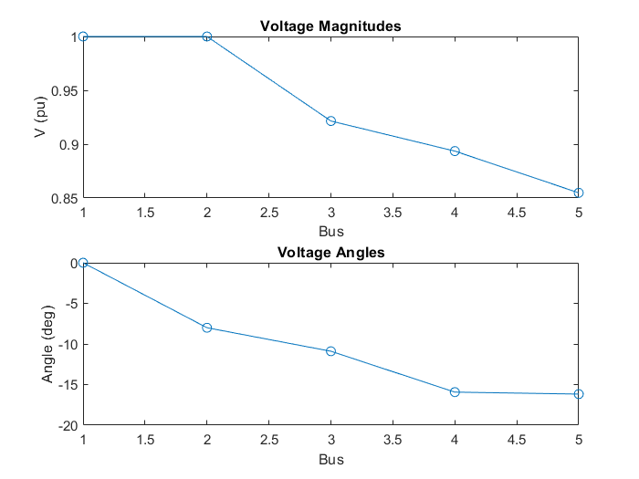

# ⚡ Load Flow Analysis using Newton-Raphson Method (MATLAB)

This project implements Load Flow (Power Flow) Analysis of a 5-bus power system using the **Newton-Raphson Method** in MATLAB. The algorithm iteratively solves non-linear algebraic equations to compute the bus voltage magnitudes and angles.

---

## 📚 Features

- Implementation of Newton-Raphson method for solving power flow
- Support for different bus types: Slack, PV, and PQ
- Admittance matrix (Ybus) formation from line data
- Full Jacobian matrix calculation
- Voltage magnitude and angle update per iteration
- Convergence check and performance display
- Voltage profile plots (magnitude & angle)

---

## 🧪 System Description

### 🔌 Bus Data
- **5 Buses**
- Bus types: 1 Slack, 1 PV, 3 PQ
- Includes generator data and load demand

### 🔗 Line Data
- 5 transmission lines with resistance, reactance, and line charging susceptance

---

## 🖥️ Files

| File                     | Description                                  |
|--------------------------|----------------------------------------------|
| `newton_raphson_loadflow.m` | Main MATLAB script with Newton-Raphson method |
| `output.txt` *(optional)*   | Sample output (voltage, angle per bus)     |
| `voltage_plot.png` *(optional)* | Plot of bus voltages and angles        |

---

## 📊 Sample Output

```
Converged in 4 iterations.

Bus	| V (pu)	| Angle (deg)
----------------------------------------
1	| 1.0000	| 0.00
2	| 0.9764	| -1.74
3	| 0.9451	| -3.67
4	| 0.9332	| -4.85
5	| 0.9207	| -5.52
```

---

## 📈 Voltage Profile Plots

### Voltage Magnitudes


### Voltage Angles
*(Add another plot if saved)*

---

## 🚀 How to Run

1. Open MATLAB
2. Run the script:
   ```matlab
   newton_raphson_loadflow
   ```
3. Check the output in the Command Window and generated plots.

---

## 📌 Notes

- Per-unit system is used throughout the calculation.
- Code is modular and easy to scale for more buses or different test systems.

---

## 🤝 Contribution

Feel free to fork the repo and enhance:
- Support for line losses
- Export results to Excel
- GUI version

---

## 📄 License

MIT License – use freely with attribution.
